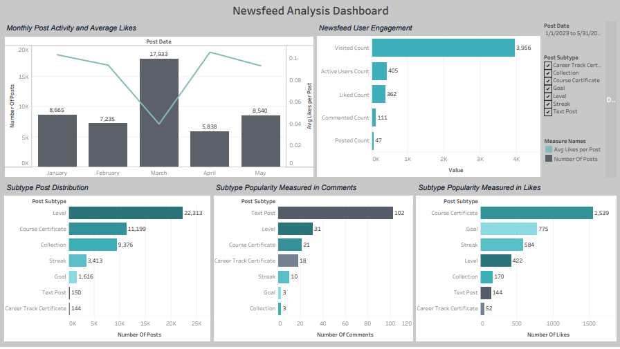

# Newsfeed Analysis | Tableau Project

## Overview of the project

This project focuses on analyzing a website's newsfeed using Tableau. The goal is to understand how users interact with the newsfeed on the 365 platform from January to May 2023. 

By creating data visualizations, we will uncover insights that can improve user engagement. The newsfeed features both automated updates, like student achievements, and manual posts where students share their thoughts. 

The project aims to determine which type of content users prefer and suggest improvements to enhance user experience and community engagement. This analysis will inform strategies to optimize the newsfeed, aiming to increase platform usage and attract more subscriptions and renewals.

* Data Sources: website's newsfeed on the 365 platform from January to May 2023 (newsfeed_analysis.twbx – a file containing the necessary CSV files for creating the graphs).
  

After analyzing post subtypes, Level-type and Collection-type posts receive the fewest likes per post, averaging about 0.02 likes each. Level-type posts are the most frequent, appearing 22,313 times, while Career Track Certificate posts are the least common, with only 144 instances, similar to Manual Text posts at 150. The engagement rate from the Newsfeed User Engagement graph shows a 10% interaction rate. Despite their prevalence, Level-type and Collection-type posts struggle to attract engagement, indicating potential saturation in the newsfeed. To enhance user experience, reducing the frequency of these less engaging posts could increase interest and engagement with more compelling content.

* Skills: Tableau | SQL

